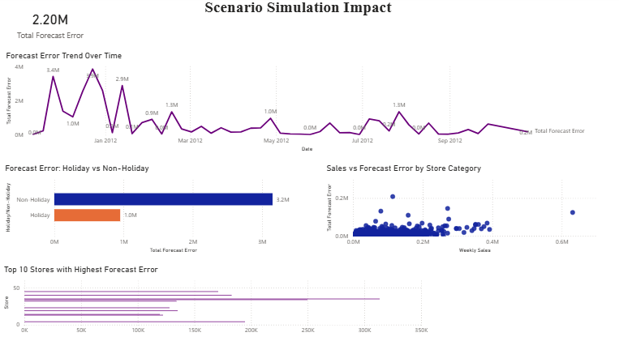
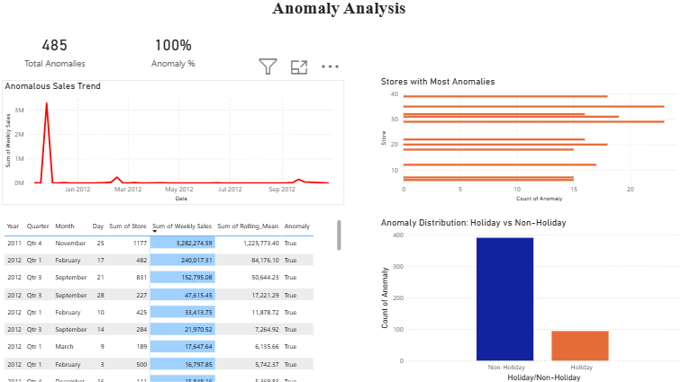

# 🛒 AI-Powered Walmart Sales Forecasting & Business Intelligence Dashboard

## Overview

This project delivers an end-to-end retail analytics solution using Python, SQL, and Power BI to analyze Walmart sales performance, forecast future sales trends, detect anomalies, and generate actionable business insights.

By integrating historical sales records, store information, and external economic indicators, the solution provides a comprehensive view of sales behavior across multiple stores and departments, enabling data-driven business decisions.

---

## 🎯 Business Problem

Retail organizations require accurate sales forecasting and performance monitoring to optimize inventory planning, workforce allocation, and revenue growth.

This project addresses key business questions:

* Which stores and departments generate the highest revenue?
* How do holidays impact sales performance?
* What are the expected future sales trends?
* Which stores show unusual sales behavior?
* How do external factors influence sales performance?

The solution combines predictive analytics and business intelligence dashboards to support strategic decision-making.

---

## 📊 Project Highlights

| Metric                 | Value               |
| ---------------------- | ------------------- |
| Total Revenue Analyzed | $1.73 Billion       |
| Predicted Sales        | $1.74 Billion       |
| Active Stores          | 45                  |
| Departments Analyzed   | 81                  |
| Detected Anomalies     | 485                 |
| Analysis Period        | Nov 2011 – Oct 2012 |

---

## 📁 Dataset

This project utilizes the Walmart Store Sales Forecasting dataset consisting of historical sales records, store information, and external economic indicators.

### Dataset Components

**Train Dataset**

* Weekly sales transactions
* Store and department sales records

**Features Dataset**

* Temperature
* Fuel Price
* CPI
* Unemployment
* Holiday indicators
* Promotional markdowns

**Stores Dataset**

* Store Type
* Store Size

The datasets were merged to create a unified analytical dataset for forecasting, anomaly detection, and business intelligence reporting.

---

## 🛠️ Technology Stack

**Programming & Analytics**

* Python
* Pandas
* NumPy

**Visualization**

* Power BI
* Matplotlib
* Seaborn

**Database**

* SQL

**Development Tools**

* Jupyter Notebook
* Git
* GitHub

---

## 🔄 Project Workflow

Raw Data

⬇

Data Cleaning & Preprocessing

⬇

Exploratory Data Analysis

⬇

SQL-Based Business Analysis

⬇

Sales Forecasting

⬇

Scenario Simulation

⬇

Anomaly Detection

⬇

Power BI Dashboard Development

⬇

Business Insights & Recommendations

---

## 🔍 Analysis Performed

### Data Preparation

* Data Cleaning
* Missing Value Treatment
* Feature Engineering
* Dataset Integration

### Sales Performance Analysis

* Revenue Trend Analysis
* Store Performance Analysis
* Department Performance Analysis
* Holiday Impact Assessment

### Forecasting Analysis

* Weekly Sales Forecasting
* Forecast Accuracy Evaluation
* Scenario Simulation

### Anomaly Detection

* Identification of Unusual Sales Patterns
* Store-Level Anomaly Analysis
* Risk Detection

### Business Intelligence

* KPI Monitoring
* Executive Reporting
* Performance Benchmarking

---

## 📈 Key Insights

* Walmart generated approximately **$1.73 Billion** in revenue during the analysis period.
* Holiday periods contributed significantly to overall sales performance.
* Forecasted sales closely aligned with actual sales trends.
* Top-performing stores generated a disproportionately high share of revenue.
* Fuel price fluctuations influenced sales behavior across stores.
* **485 anomalous sales observations** were identified for operational review.

---

### Executive Sales Dashboard

The executive dashboard provides a consolidated view of revenue, forecasted sales, store performance, department performance, holiday impact, and overall sales trends.


---

### Forecasting & Scenario Simulation Dashboard

This dashboard evaluates forecast performance, tracks prediction accuracy, analyzes forecast errors, and compares actual versus predicted sales.



---

### Anomaly Detection Dashboard

The anomaly detection dashboard identifies unusual sales patterns, highlights stores with abnormal sales behavior, and supports operational risk analysis.


## 💡 Business Impact

This solution enables retail stakeholders to:

* Improve sales forecasting accuracy
* Monitor store and department performance
* Detect unusual sales activity proactively
* Optimize inventory planning
* Improve holiday sales preparation
* Support strategic decision-making through analytics

---

## 📂 Repository Structure

```text
Walmart-Sales-Forecasting/
│
├── data/
│   ├── train.csv
│   ├── features.csv
│   ├── stores.csv
│   └── walmart_final_v3.csv
│
├── notebooks/
│   └── WALMARTS.ipynb
│
├── sql/
│   └── walmart_analysis.sql
│
├── screenshots/
│   ├── executive-dashboard.png
│   ├── forecast-analysis.png
│   └── anomaly-analysis.png
│
└── README.md
```

---

## 👨‍💻 Author

**Astha**

Data Analytics | SQL | Python | Power BI | Business Intelligence | Machine Learning

Passionate about transforming raw business data into actionable insights through analytics, visualization, and predictive modeling.
